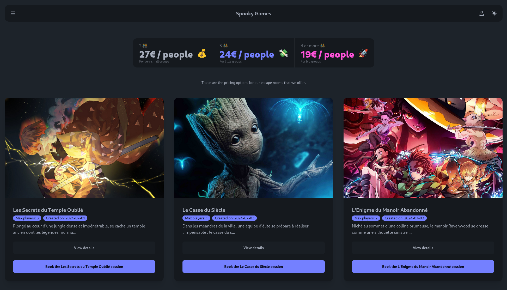
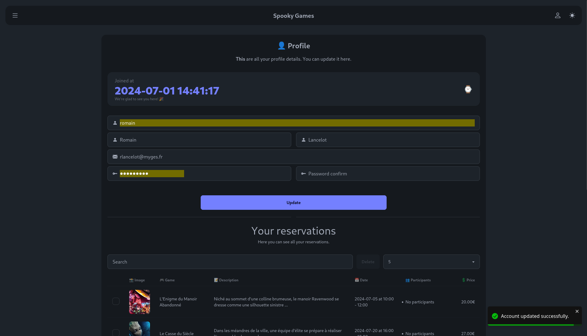

<h1>Spooky Games</h1>

Spooky Games is a website about horrific escape games that will make you feel like you are in a horror movie. The website is designed to be a fun and interactive experience for users who enjoy horror games.

<h1>Table of Contents</h1>

- [Deployment](#deployment)
- [Sneak peek](#sneak-peek)
- [Authors](#authors)
- [Acknowledgements](#acknowledgements)
- [License](#license)

# Deployment

To deploy each component of the website, please check the README file in each folder.

# Sneak peek

Here is a sneak peek of the website:

You can see all the sessions available on the website and book the one you want.
You can also see the details of each session and book it.

You can modify your profile information and see your different reservations.

# Authors

This website was created by a team of developers who are passionate about horror games. The team members are:

- [Romain LANCELOT](https://github.com/romainlancelot)
- [Jordan DUFRESNE](https://github.com/jordan95v)
- [Steven CHOUK](https://github.com/Sheukn)

# Acknowledgements

We would like to thank our teachers and mentors for their guidance and support throughout the development of this website.

# License

This project is licensed under the MIT License - see the [LICENSE.md](LICENSE) file for details.
